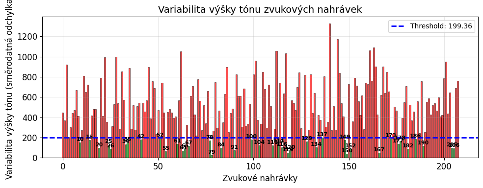

# Voice analysis for the detection of pathological changes in voices from PhysioNet VOICED Database

> Computer Signal Processing term papers.

The thesis deals with the analysis of voice recordings from the [PhysioNet VOICED Database](https://physionet.org/content/voiced/1.0.0/). The voice recordings are loaded into the Python environment. Subsequently, the signals are binary classified as healthy and pathological according to their characteristics. Predetermined rules are used for sorting. No machine learning method is used for classification. The accuracy of the classification is verified on expert annotated data.

## Installation

Pip:

```sh
pip install jupyterlab
jupyter lab
```

UV:

```sh
uv run --with jupyter jupyter lab
```

or

```sh
uv add --dev ipykernel
uv run ipython kernel install --user --env VIRTUAL_ENV $(pwd)/.venv --name=project
uv run --with jupyter jupyter lab
```

## Usage

* Run cells 1-11 first to define all functions
* Execute cells 12-18 sequentially for the main analysis
* Use cells 19-20 for additional data exploration
* Modify the config in cell 12 and rerun the analysis without redefining functions



## Development setup

Clone this repository and install dependencies.

Pip:

```sh
pip install -r requirements.txt
```

UV:

```sh
uv venv
uv pip install -e .
```

## Release History

* 0.1.0
  * The first proper release
  * CHANGE: created proper README
* 0.0.1
  * Work in progress

## Meta

Martin Žoha – <mates.zoha@gmail.com>

Distributed under the Unlicense license. See ``LICENSE`` for more information.

[https://github.com/Zohino/](https://github.com/zohino/)

## Contributing

1. Fork it (<https://github.com/Username/repo/fork>)
2. Create your feature branch (`git checkout -b feature/fooBar`)
3. Commit your changes (`git commit -am 'Add some fooBar'`)
4. Push to the branch (`git push origin feature/fooBar`)
5. Create a new Pull Request
